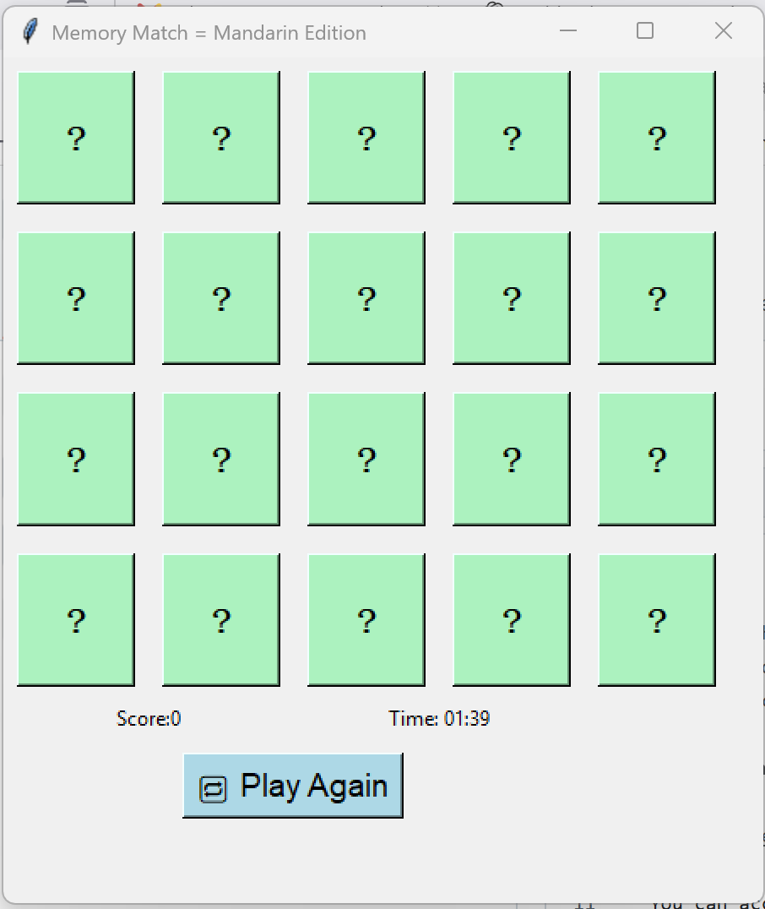

## 💾 How to Play (No Coding Needed)

1. Go to the [Releases](https://github.com/soniaclairesingh/python-projects/releases) page.
2. Download the latest version of `MandarinMemoryGame.exe`
3. Double-click to play — no additional installation needed!

> 🧠 Match the Mandarin numbers to their Arabic equivalents before time runs out!

You can access the code here --> 
